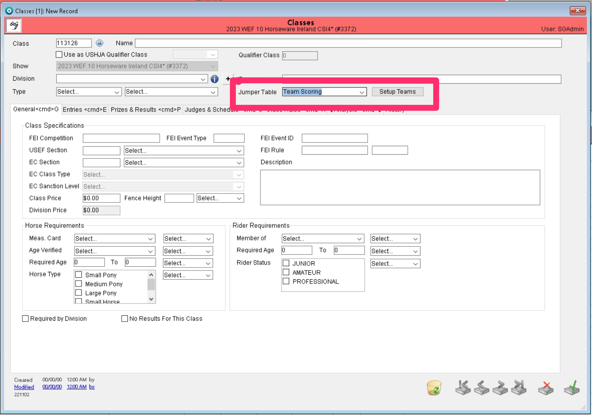
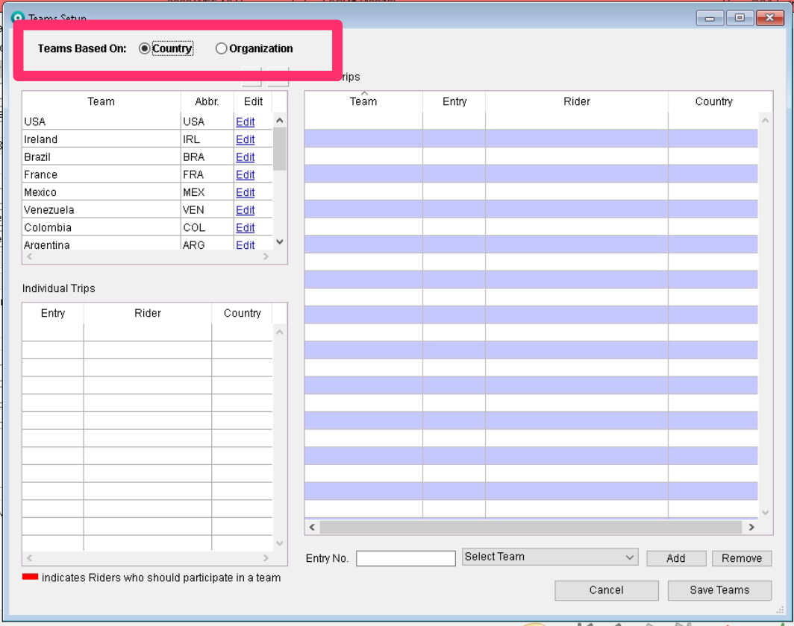
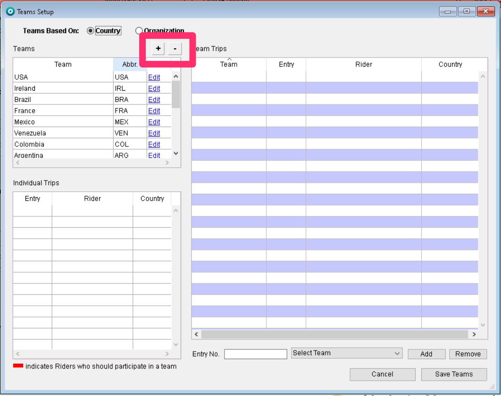
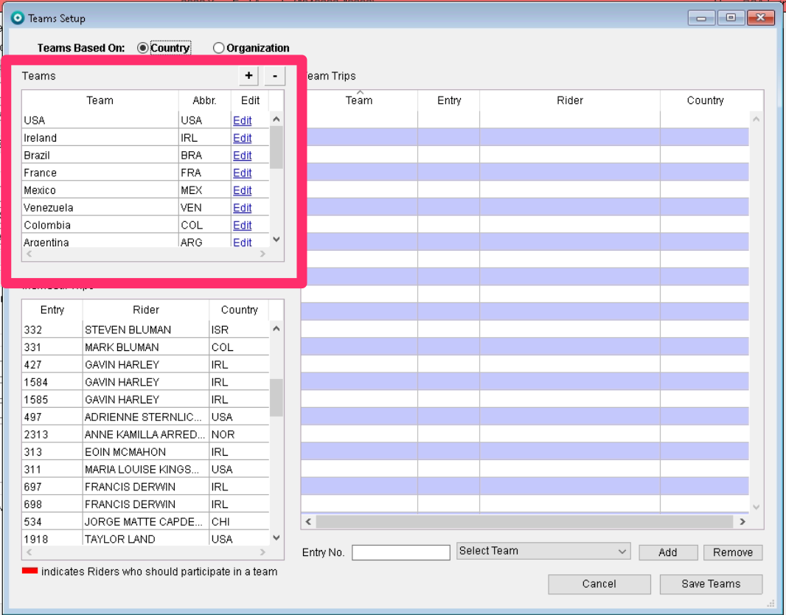

# Team Scoring

## Team Scoring

Team scoring can be found when setting up a class under the Jumper Table drop-down list.

<figure><figcaption></figcaption></figure>

Once you have selected the team scoring option, a box will appear for “Setup teams”.

<figure><figcaption></figcaption></figure>

From here you can choose what type of team you will require for the class. Country or Organization team.

<figure><figcaption></figcaption></figure>

&#x20;

### Team Based on Country

You can add a team by using the “+” button at the top of the window.&#x20;

<figure><figcaption></figcaption></figure>

When you have pressed that option, a box will appear allowing you to create a team. You will start by entering your team name.&#x20;

<figure><figcaption></figcaption></figure>

If you have selected Country for the type of team, a drop-down list will appear with all the countries you can choose from.

<figure><figcaption></figcaption></figure>

Once you have created the team, it will show in the list of teams in the top left box of this window. Country teams that have already been used will show in this list.&#x20;

<figure><figcaption></figcaption></figure>

If you double click on each team, it will create your team's list to associate your list of entries to. As you choose your teams, the entries that ride for that country will show in red.&#x20;

#### Adding Entries to a Team

All trips entered in the class will appear at the bottom of the window. The entries will be highlighted if they should be participating in a team but are not yet entered in the team.

<figure><figcaption></figcaption></figure>

There are two ways you can add a rider to a team.&#x20;

1. The first way to add riders to your team is by dragging them from the list of Individual trips to the specific team.

\

<figure><figcaption></figcaption></figure>

2. The other way to add/remove riders to/from a team is by using the Add/Remove option at the bottom of the page. In the “Entry No. box, you simply enter an entry number. In the dropbox to the right, you would choose which team you want that entry to go to and then click the add button. This works the same for removing an entry from a team.

Once you have set up your teams, select the “Save Teams” button at the bottom of the page.

## FEI Nations Cup

FEI Nations Cup is also found in the Jumper Table drop-down list. When you’ve selected that option, the same “Setup Teams” button will appear.

&#x20;

The process for setting up the FEI Nations Cup and for Team Scoring is exactly the same. You are given your option of teams by country or organization. Adding and removing your teams and entries is the same process.

&#x20;

**Announcer Interface**

Once you have your teams set up and ready to use this announcer interface, you access this through the Quick Actions wheel. You can set your Order of Go in this interface.

&#x20;

Once you are in the Ingate & Announcer tab, your entries will show on the left and will show their team abbreviation. There is a check box for “Going” and another for “Scratched.” If you choose the “Going,” it will show all the information for that specific trip.

