# Wellington International - Nations Cup

## Table of Contents

* [Class Setup](wellington-international-nations-cup.md#class-setup)
* [Setting Up Teams](wellington-international-nations-cup.md#setting-up-teams)
* [Setting Order of Go](wellington-international-nations-cup.md#setting-order-of-go)
* [Pyramid Software Setup](wellington-international-nations-cup.md#pyramid-software-setup)
* [Graphics Setup and ](wellington-international-nations-cup.md#graphics-setup-and-use)[Use ](wellington-international-nations-cup.md#graphics-setup-and-use)
* [Live Results](wellington-international-nations-cup.md#live-results)
* [Final Results](wellington-international-nations-cup.md#final-results)

### Class Setup

Advanced Timing: At least one week prior to event.

**Who's Responsible:** Jenn and/or Hali

The following are critical to the succesful setup of the FEI nations cup class.

#### FEI Show and Class Integration

The show must pull the classes from the FEI database through the API.  Please read the following article for details on how to do this.

[FEI Integration](https://docs.showgroundsonline.com/doc/showgrounds-manual/#7410)

#### Nations Cup is run as a Single class

It is critical that Nation's Cup be run as a single class; in the past the jump off phase of the event has been setup as a second class. This is not necessary and will cause all final round real time scoring to fail. &#x20;

### Setting Up Teams

Advance Timing: 24 Hours Minimum (sooner is better)&#x20;

**Who's Responsible:** Liz&#x20;

Teams must be setup well in advance of the event.  In years past this has been done often after the event is completed.  We recommend that teams be setup at least 24 hours in advance and earlier if possible. &#x20;

#### How to Set up Your Teams

To set up the teams for the Nation's Cup, the user will open the class. Selecting the Nation's Cup is done in the Jumper Table dropbox. The FEI Nation's Cup selection is at the bottom of the list.&#x20;

<figure><figcaption></figcaption></figure>

Once you have selected the Nation's Cup, you will choose the option to "Setup Teams."

<figure>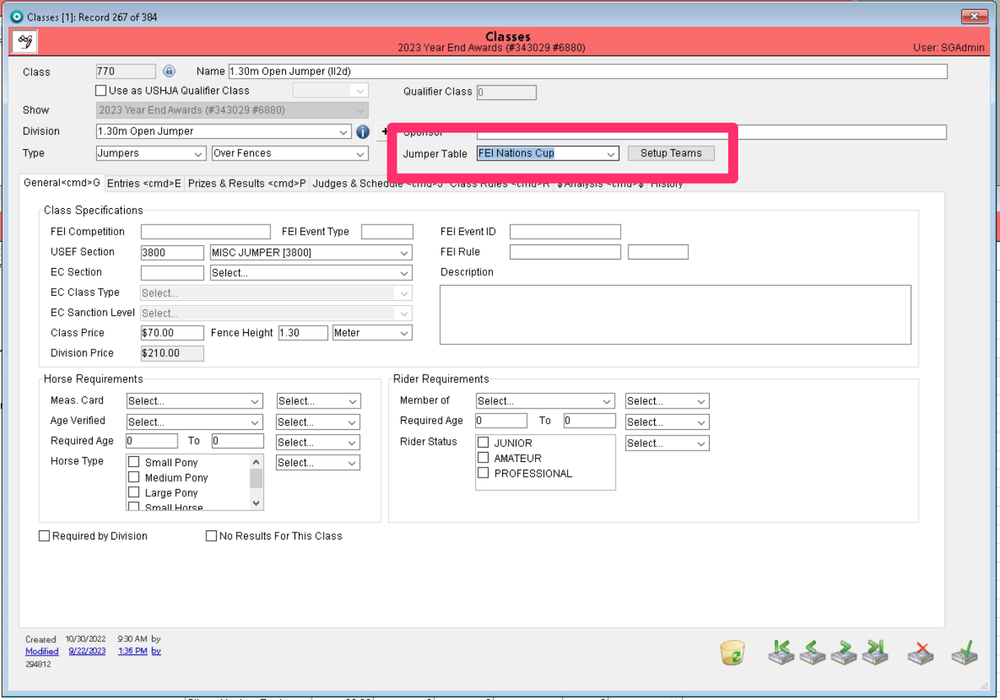<figcaption></figcaption></figure>

This will bring you to the screen to set up each team.&#x20;

<figure><figcaption></figcaption></figure>

#### Selecting Teams

Since your teams are based on countries, you will keep the Country option checked. A list of countries that have been created as a team will show. If you need to add to the list of teams or remove any of these teams, this can be done with the plus or minus signs.&#x20;

<figure><figcaption></figcaption></figure>

Double clicking the desired teams will bring them from the list on the left to the list on the right. Once your team is in the list on the right, you can associate entries to the team.&#x20;

<figure><figcaption></figcaption></figure>

As you move your teams to the list on the right, entries that should be associated to the team that have not been moved will be highlighted in red.&#x20;

<figure><figcaption></figcaption></figure>

#### Adding Entries to Teams

There are two ways you can add entries to your teams.&#x20;

1. Entries can be added to a team by dragging them from the list on the left to the desired team in the list on the right.&#x20;

<figure><figcaption></figcaption></figure>

1. The other way to add an entry to a team is by entering the entry number and selecting the desired team from the dropbox at the bottom of the page.&#x20;

<figure><figcaption></figcaption></figure>

Once all of your teams have been set up and all of your entries associated to their teams, you will need to save the teams. This is done by choosing the Save Teams option at the bottom of the page.&#x20;

<figure>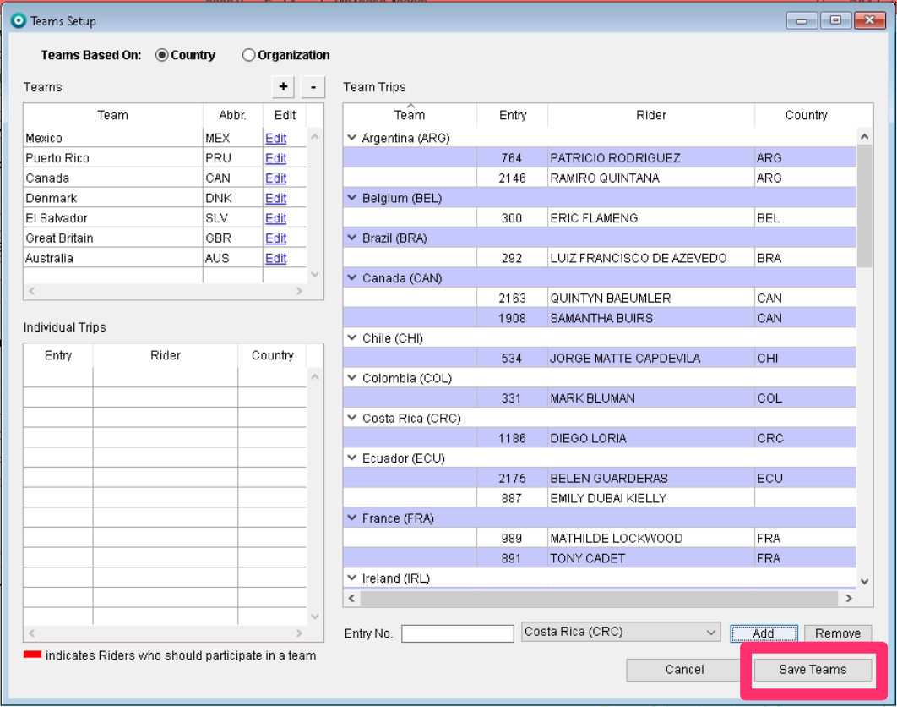<figcaption></figcaption></figure>

#### Verify the following

1. Rider Flags - Ensure all rider flags are set correctly by setting the "Riding For" field in the RTO record using the dropdown picture below. This is the flag used when a rider is on course and should be consistent with the team flag that that rider is riding for.&#x20;

<figure><figcaption></figcaption></figure>

### Setting Order of Go

**Advance Timing: 24 Hours Minimum**

Order of go is critical to the proper functioning of the system.  This order needs to be set in the system in advance of the event, ideally 24 hours in advance so that the data and setup can be verified.&#x20;

Please access the following link for the Order of Go directions.

[Order of Go Directions](https://gitbook.showgroundsonline.com/showgrounds-cloud-documentation/modules/tools/order-of-go)

Pyramid Software Setup

Advance Timing: Day of, in advance of class (Steven)&#x20;

Pyramid sends R1 data to frame 7 and R2 data frame 8 - the same as any other jumper class. In pyramid the software should be configured as a regular jumper class.&#x20;

A test of pyramid can be run in advance of the show and the SGL team can verify that our scoring server (SRN) is receiving this data as expected. &#x20;

### Graphics Setup and Use

Who's Responsible: Kevin Reilly

Graphics are handled by Kevin using RossXpression

### During the Event

#### Ingate Tool:&#x20;

As long as all the previous steps have been completed meaning team setup, OOG, testing etc. the ingate tool will have all the trips to the left in "Trips Remaining" just like any other class. They are listed in the order of go with the stagger showing additional columns for Team Name and Score.&#x20;

<figure><figcaption></figcaption></figure>

In Round 2 Callback teams have been added in this tool for the Nation's Cup event . This MUST be set prior to the start of the class by selecting the proper table when the class is first set up in order to function properly. Setting this value to 0 will mean that all teams qualify for a second round. It's also important to be sure to set up the JO Time Allowed. (Previous years, this has been set to 1)&#x20;

Once the trip is started, the Ingate Stagger will show the trips gone:&#x20;

<figure>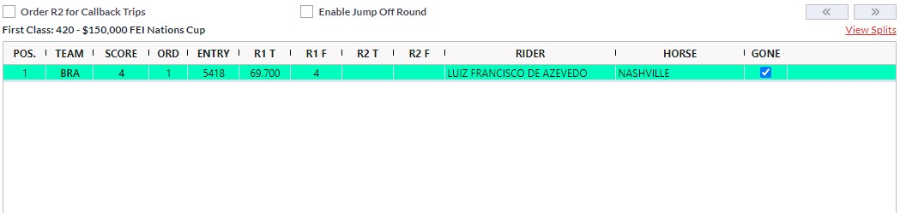<figcaption></figcaption></figure>

As the class progresses the Ingate will also show the qualifying trips with colored rows, while teams/rounds not currently eligible for Round 2 (ranked below 8th place) will be shown in white. Each team's trips and scores will show as a group. Dropped trips are shown in red.

A team's current cumulative score and time will be shown under the "score" column. The drop trip will not be considered in this calculation until each rider has completed their round.

<figure><figcaption>
For this example, in Round 1, Canada's drop score will not be considered until Beth Underhill (last rider for the team) has completed the course.
</figcaption></figure>

The ingate computer shows round 2 trips with different color.

<figure><figcaption>
Here, the top two (lighter green) entries have completed the second round while the bottom two (darker blue/green) have only completed the first round.
</figcaption></figure>

### Jump Off Scenario

If there is a tie for Gold after the two rounds, a Jump Off can be chosen to determine the tie breaker. Please follow the below instructions should a Jump Off run in the Nations Cup:

1. Select "Enable Jump Off Round" checkbox above the class results grid in the announcer tool. This checkbox enables JO round data columns (JO Trip, Faults, and Time) in class result grids and JO time-allowed fields for class group settings.

<figure><figcaption></figcaption></figure>

2. Set the Time Allowed for the Jump Off. Note that checkboxes populate for Jump Off Eligible Teams and a faults/time table labeled Trip/Time 3 is now in place should a Jump Off be run.

<figure><figcaption>
\
</figcaption></figure>

3. Set the checkbox under "JO Trip" for the entries selected to Jump Off. Checking these boxes will change the entry to yellow to indicate the jump off trip.

<figure><figcaption></figcaption></figure>

### Live Results

On the live class page, all trips will be lined up in section according to their Order of Go.&#x20;

<figure>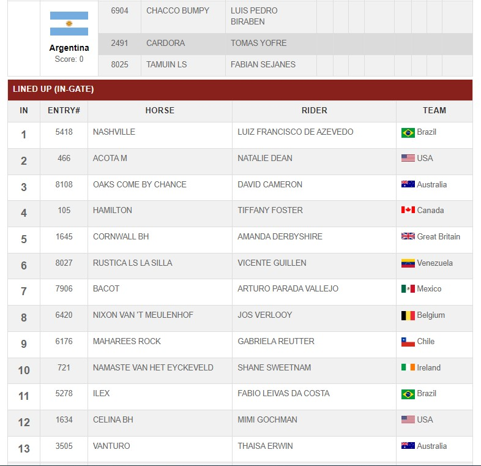<figcaption></figcaption></figure>

Once Pyramid timing updates start coming in the first trip will appear in the Live Now section:&#x20;

<figure>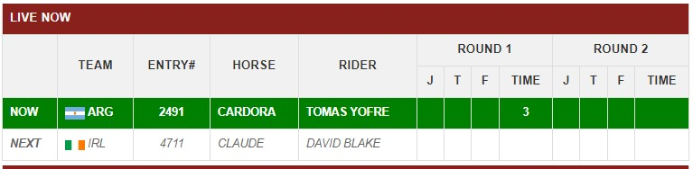<figcaption></figcaption></figure>

As the class progresses, trips from the different teams are going and the live class page will reflect the scores and the team positions:&#x20;

<figure>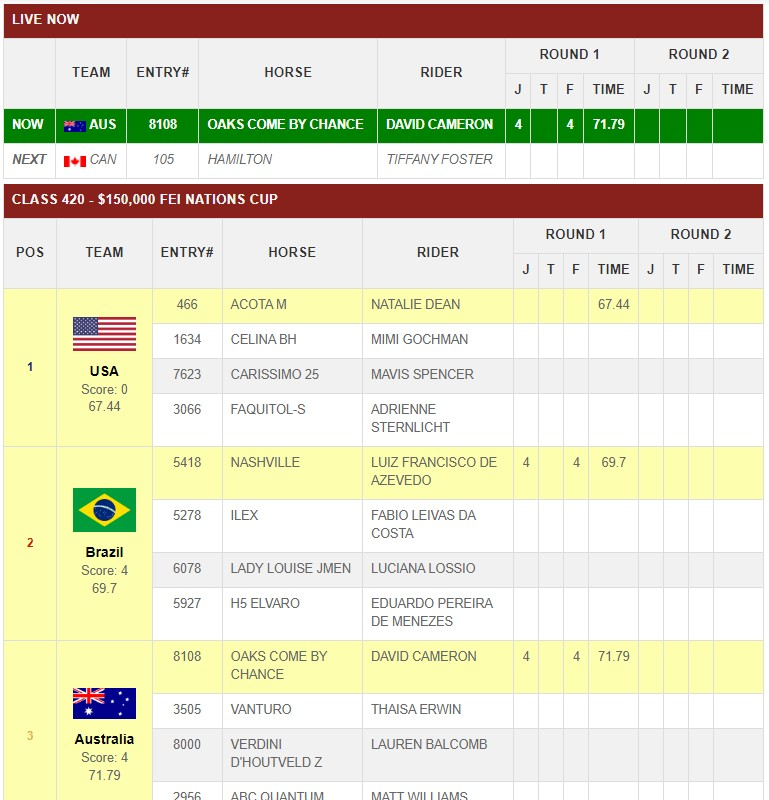<figcaption></figcaption></figure>

The score and time for each team will be a total cumulative for all team trips gone. The drop trip will not be considered in this calculation until each of the team's riders has competed. Teams highlighted in yellow are currently eligible to compete in Round 2 (they are currently ranked as being in the top 8).

After completing trips from more teams, the teams that do NOT qualify for the second round are displayed without the callback color and do not show any R2 position in the column. This will change during the course as more trips are completed&#x20;

<figure>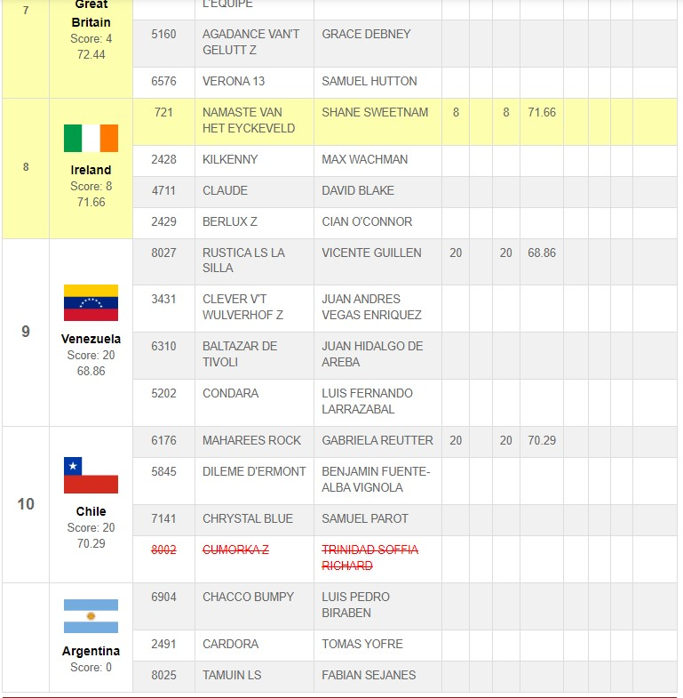<figcaption></figcaption></figure>

When the second round starts, the trips and teams are displayed with different colors indicating round 2. The team score is now combined with round 1 and round 2 faults.&#x20;

<figure>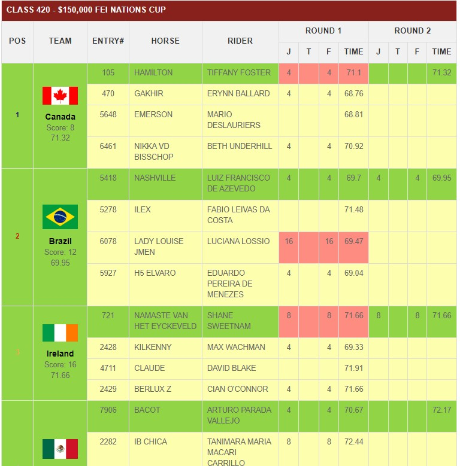<figcaption></figcaption></figure>

After completing all round 2 trips the live class page will look like this:

<figure>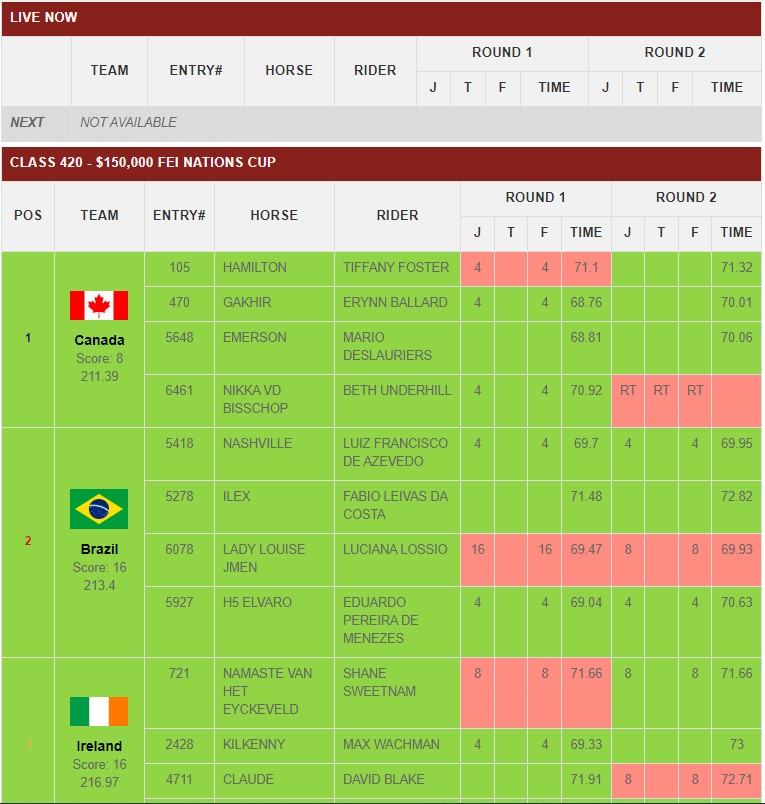<figcaption></figcaption></figure>

Note the tie in 2nd and 3rd positions. The Tiebreaker is now the round 2 score per the FEI rule. Should the teams remain tied, the combined times (excluding drop trips) will break the tie. The team score is combined of faults of round 1 and 2, excluding the drop trips for each round.&#x20;

[**Final Results**](#user-content-fn-1)[^1]

The final results for the class will show the order of teams by placing.

<figure>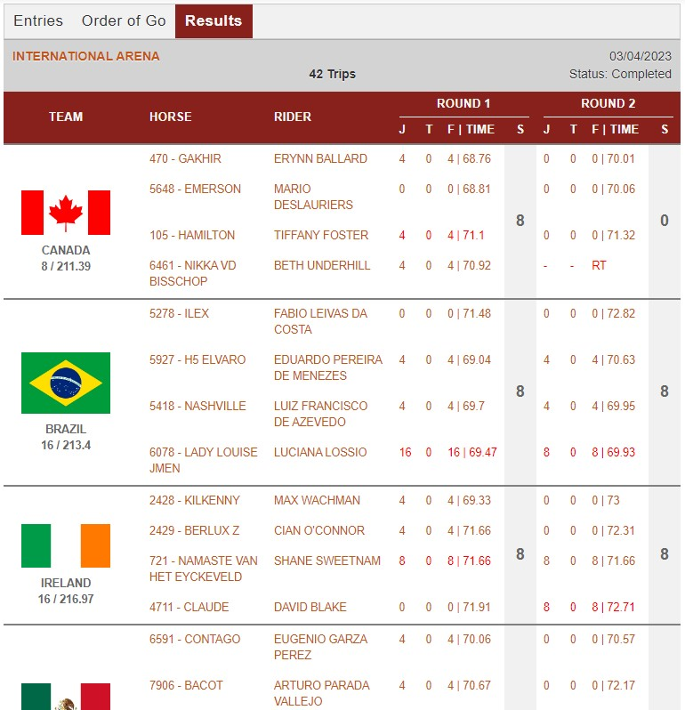<figcaption></figcaption></figure>

<figure><figcaption></figcaption></figure>

<figure>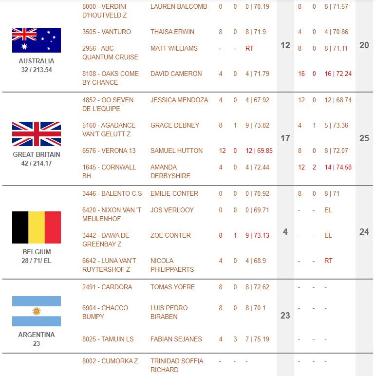<figcaption></figcaption></figure>

<figure><figcaption></figcaption></figure>

If teams are tied by the number of faults for any position other than first place, the tie will be broken by the sum of the trips' second round times. For example, Brazil and Ireland are tied based on the number of faults. However, if you add the second round times for both teams, Brazil's second round time adds up to be 213.4 and Ireland's jump off time adds up to 216.97. So that logic put Brazil in second place and Ireland in third.&#x20;

<figure><figcaption></figcaption></figure>

The results will also show the dropped trips for each team in red. If we take a look at Ireland's trips, you will see the dropped trip for round 1 was entry 721 and for the second round was entry 4711.&#x20;

<figure><figcaption></figcaption></figure>

[^1]: 
