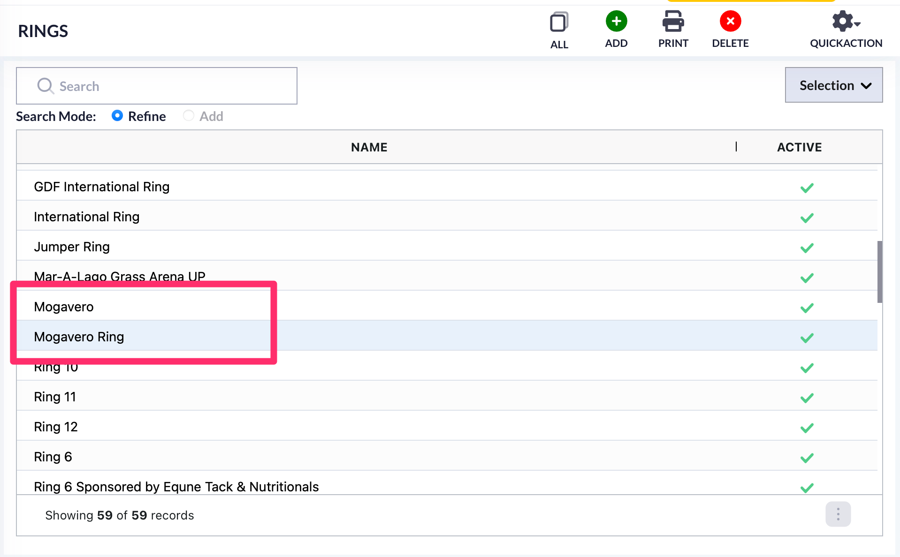
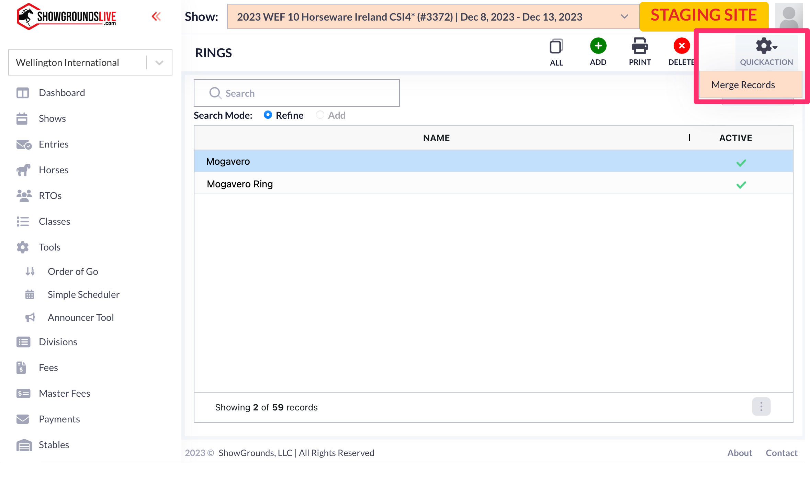

# Ring Merge

## Duplicate Rings

In 4D, customers had different facilities with similar rings. With the move to the cloud and the difference in how these modules work, there are now rings listed multiple times.&#x20;

For example, in Wellington's system, we will look at these rings. There are multiple Mogavero Rings.&#x20;

<figure><figcaption></figcaption></figure>

This was caused by multiple facilites using the same rings in 4D.&#x20;

Now that rings are going to work differently in the cloud, these rings can be merged.

## Merging Rings

This process is done by first creating a subset of the rings you want to merge.&#x20;

Creating a subset is done by highlighting the specific records. Then, you will go to the Selection dropbox and choose Show Subset.

<figure><figcaption></figcaption></figure>

Doing this will then show only the rings you had highlighted.&#x20;

<figure><figcaption></figcaption></figure>

Then, you will go to the Quick Action menu. There is only one option in this menu. This is the Merge Records option.&#x20;

<figure><figcaption></figcaption></figure>

\*\*If you select to merge the rings, you need to have the ring you want to keep highlighted. If you do not have a ring highlighted, the system will give this Alert.&#x20;

<figure><figcaption></figcaption></figure>

Choosing the Merge Records option will bring up a confirmation box. Since this is not reversable, it will show this message. You need to be absolutely sure you want to merge the records before you complete this.&#x20;

<figure><figcaption></figcaption></figure>

Choosing OK will then merge the records. The ring name will now show as the ring you had highlighted during the merge process.&#x20;

<figure><figcaption></figcaption></figure>
