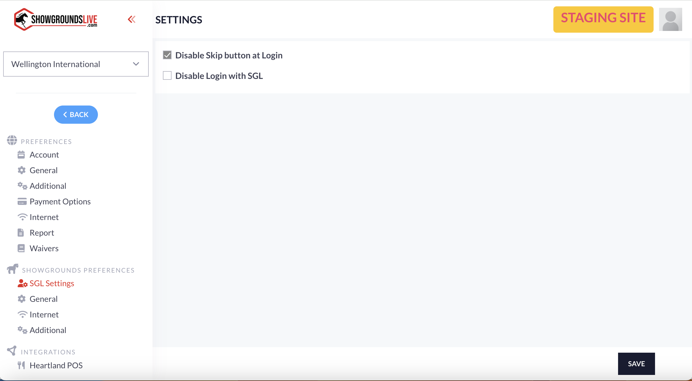

# ShowGrounds Preferences

## Introduction

ShowGrounds Preferences are only editable by SGAdmin, but are important for how the software runs.&#x20;

There are four different sections of settings found in this area.&#x20;

[SGL Settings](showgrounds-preferences.md#sgl-settings)

[General](showgrounds-preferences.md#general)

[Internet ](showgrounds-preferences.md#internet)

[Additional](showgrounds-preferences.md#additional)

## SGL Settings

The settings found in this section control the login portion to the program.&#x20;

<figure><figcaption></figcaption></figure>

There are two options that can be enabled or disabled here.&#x20;

1. Disable Skip button at Login
   1. This feature was used when login linking was implemented.&#x20;
   2. With this setting enabled, users can no longer skip the linking portion at login.
2. Disable Login with SGL
   1. When this setting is enabled, it does not allow users to log in with their ShowgroundsLive emails and passwords.&#x20;
   2. This setting should not be enabled.

## General

The preference settings found in the general section of preferences include settings for ingate abilities, trip information, and TIN check settings.

<figure><figcaption></figcaption></figure>

1. Enable Get Trips API
   1. This setting
2. Add Rider from In-gate
   1. When this setting is enabled, ingate users are then allowed to add riders to an entry at the ingate.&#x20;
3. Add Entry from In-gate
   1. This setting allows or disallows ingate users to add an entry to a class at the time of the class.&#x20;
4. Use point horse for ordering
5. Enable Farmtek
   1. If a company is using Farmtek equipment, this setting should be enabled to sync the information received from Farmtek to the SGL program.&#x20;
6. Trip Go time gap limit
   1. The time gap limit for this setting is set in seconds.&#x20;
7. TIN Server Address
   1. If a company is using TIN checks for prize money, the site that is being used for those TIN checks should be input into this box.
8. TIN User Login
   1. The login username for the TIN check account should be input into this box.
9. TIN User Password
   1. The password for that TIN check account needs to be input into this box.

## Internet

The internet portion of the ShowGrounds preferences determine the specific gateway information for that show company.

<figure><figcaption></figcaption></figure>

This section of settings is titled as Spreedly Settings. These settings are specific for the gateway(s) for the specific show company.&#x20;

1. Enable
   1. This setting enables the gateway for that company.
2. Check Blocked Cards
   1. This setting enables the ability to check any cards that are unavailable for use.&#x20;
3. Payment Gateway
   1. The dropbox allows the user to select the gateway. It will automatically be defaulted to the default gateway that has been chosen for the show.
4. Gateway Name
   1. When the specific gateway is chosen in the payment gateway dropbox, the gateway name will show in this box.&#x20;
5. Gateway Token
   1. The gateway token for the specific gateway will show in this box.&#x20;
6. Payment Currency
   1. Depending on where the show company is located, the payment currency type can be set for USD or CAD.&#x20;

## Additional

The additional section of the preferences provides the API information for all of the membership lookups. These include USEF information, FEI, USHJA, NORCAL, and OHJA.&#x20;

The information input into these boxes are starred out to not show the specific information.&#x20;

<figure><figcaption></figcaption></figure>

The information input into this setting section is very important for the lookup of memberships.&#x20;
