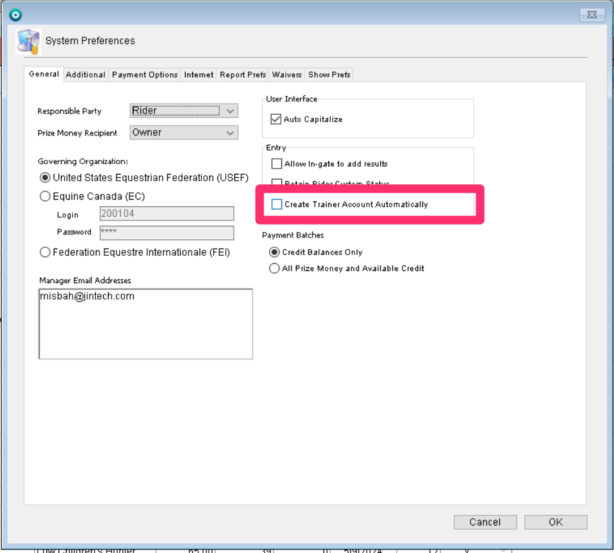
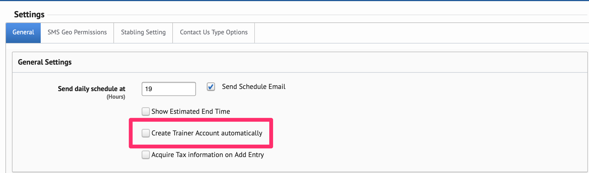

# System Preferences

To access the system preferences, you will log into the client.&#x20;

Once logged in, you will go to the File option in the upper left corner and choose the Administration option from the list. &#x20;

Once you have chosen that option, a list of areas will show up. You will continue with the Edit System Preferences option.

When you click that option, the system preferences will open to the General tab of those preferences. In this tab, is where you will choose the governing organization. For the EC login, you will want to put in our generic login credentials unless they are otherwise provided.&#x20;

The other settings you will want to make sure are set correctly are found in the Internet tab. These checkboxes allow for lookups of people and horses in those specific organizations.&#x20;

Once you have everything set here, you can click ok to save the changes.

### Trainer Accounts Settings

There are two areas in which trainer account settings should be enabled. For trainer accounts to work correctly, both of these settings need to be enabled.&#x20;

#### System Preferences

One of these settings is found in the system preferences in 4D.&#x20;

<figure><figcaption></figcaption></figure>

To enable the setting, the checkbox must be selected.&#x20;

#### PHP Setting

In order to make sure the setting in the PHP site is enabled, you must be logged into the admin site for that particular show company.&#x20;

Once you are in the admin site for that particular show company, you will want to choose the Settings option under the SGL Functions tab.&#x20;

<figure><figcaption></figcaption></figure>

On this general page, you will find the other Trainer account setting.&#x20;

<figure><figcaption></figcaption></figure>

This checkbox should be checked to enable to trainer accounts.&#x20;
